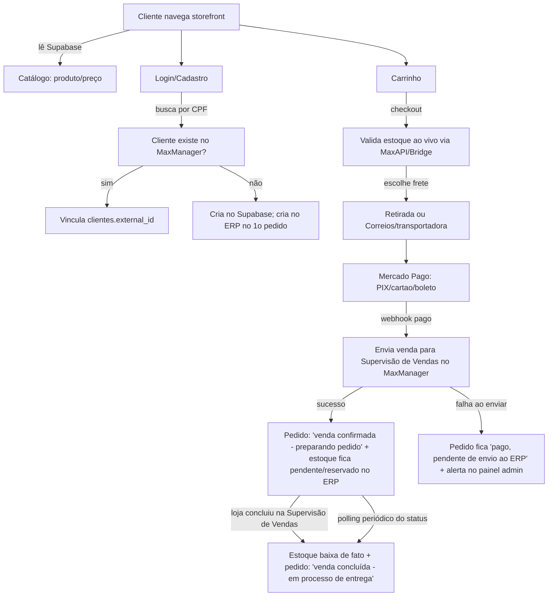

# Módulo de E-commerce — Design (decomposição e visão geral)

## Contexto

O lc-dashboard hoje é um painel administrativo interno (lojistas, vendas, produtos, financeiro) integrado ao ERP MaxManager. Este documento cobre a decisão de arquitetura de alto nível para adicionar um **e-commerce voltado a clientes finais** das lojas, e decompõe o trabalho em sub-projetos que serão especificados e planejados individualmente.

"Módulo completo de e-commerce" não é um projeto único — envolve subsistemas com responsabilidades e ritmos de evolução distintos (catálogo, checkout, pagamento, conta de cliente, sincronização com ERP, administração). Este spec cobre a arquitetura geral e a ordem de construção; cada sub-projeto da seção 2 terá seu próprio spec + plano de implementação.

## 1. Arquitetura geral

**Dois projetos, um banco:**

- **Novo repositório** `lc-storefront` (Next.js, deploy Vercel próprio) — cuida da vitrine pública, carrinho, checkout e conta de cliente. Cada loja tem seu próprio subdomínio (ex.: `lojaX.suamarca.com.br`).
- **lc-dashboard atual** ganha um **novo módulo administrativo**, seguindo o padrão já existente de gestão de módulos (ver `docs/superpowers/specs/2026-07-04-gestao-modulos-design.md`) — o lojista habilita a loja, configura frete/aparência e acompanha pedidos.
- **Mesmo Supabase (banco único)** — o storefront usa uma **anon key com RLS restritivo**, expondo apenas o que é público (produtos ativos da própria loja, carrinho e pedidos do próprio cliente autenticado). O dashboard admin continua usando `service role` como já faz hoje.

Justificativa: evita duplicar autenticação e gestão de loja; mantém o storefront público isolado do painel interno (reduz superfície de risco — uma falha no storefront público não deve expor dados/operações administrativas); usa RLS do Postgres como fronteira de segurança real entre público e admin, em vez de confiar apenas em lógica de aplicação.

## 2. Sub-projetos e ordem de construção

| # | Sub-projeto | Entrega | Depende de |
|---|---|---|---|
| 1 | Catálogo/storefront | Vitrine pública por loja; produto e preço lidos do Supabase (já sincronizado do MaxManager); estoque validado ao vivo no momento do checkout | — (base) |
| 2 | Conta de cliente | Cadastro/login no storefront; vínculo com o cliente já existente no MaxManager por CPF/e-mail; criação de cliente novo (Supabase + ERP) se não existir | Catálogo |
| 3 | Carrinho/Checkout | Carrinho; cálculo de frete — cliente escolhe entre retirada na loja ou entrega via Correios/transportadora | Catálogo + Conta |
| 4 | Pagamento | Integração com Mercado Pago (PIX, cartão, boleto) via checkout transparente; webhook de confirmação | Checkout |
| 5 | Pedido → ERP | Ao confirmar pagamento, envia a venda para a fila de **Supervisão de Vendas** no MaxManager (estoque fica reservado/pendente); ao ser concluída manualmente pela loja, estoque baixa de fato e o pedido é atualizado | Pagamento |
| 6 | Painel admin (módulo no lc-dashboard) | Lojista habilita a loja, configura frete/aparência, acompanha pedidos | Constrói-se em paralelo com 1–5, crescendo junto de cada entrega |

A ordem 1→5 é sequencial: cada item é pré-requisito técnico do seguinte (não há como testar pagamento sem checkout, nem checkout sem catálogo). O painel admin (6) começa em paralelo desde o início, mesmo que simples, porque cada sub-projeto anterior precisa de uma tela de configuração correspondente.

Cada sub-projeto 1–6 recebe seu próprio spec (`docs/superpowers/specs/`) e plano de implementação (`docs/superpowers/plans/`) quando for a vez de detalhá-lo.

## 3. Fluxo de dados (pedido ponta a ponta)

**Ponto crítico (K → M):** se o envio da venda para a Supervisão de Vendas falhar após o cliente já ter pago, o pedido não pode simplesmente se perder. Precisa de um estado intermediário (`pago_pendente_erp`) com retry, visível no painel admin do lojista.

**Detecção de conclusão (N → O):** o sistema consulta periodicamente (a cada poucos minutos, mesmo padrão da sincronização incremental já usada hoje) o status da venda no MaxManager, e assim que detecta que a loja concluiu na Supervisão de Vendas, atualiza o pedido para "venda concluída - em processo de entrega".

## 4. Tratamento de erros

- **Estoque insuficiente no checkout**: revalidado ao vivo antes de gerar cobrança; se não bater, o cliente é avisado antes de pagar, não depois.
- **Falha no gateway de pagamento** (Mercado Pago indisponível, cartão recusado): pedido fica em `aguardando_pagamento`; nada é criado no ERP até confirmação via webhook.
- **Falha ao enviar a venda para a Supervisão de Vendas**: pedido pago fica em `pago_pendente_erp` + retry automático com backoff + alerta no painel admin para lançamento manual como último recurso. Um pedido pago nunca pode ser perdido.
- **Venda parada na Supervisão de Vendas sem conclusão**: o pedido permanece em "venda confirmada - preparando pedido" até a loja concluir manualmente; não é tratado como erro do sistema, é um passo humano esperado do fluxo.
- **Falha de frete** (API dos Correios/transportadora indisponível): fallback temporário para "só retirada", com aviso na tela, em vez de travar o checkout inteiro.
- **Webhook duplicado ou fora de ordem** (Mercado Pago pode reenviar notificações): idempotência por identificador externo do pagamento antes de processar.

## 5. Testes

- **Catálogo/Checkout**: testes de integração garantindo que preço/estoque exibido bate com o Supabase, e que a revalidação de estoque ao vivo bloqueia corretamente quando insuficiente.
- **Pagamento**: testes do webhook do Mercado Pago com payloads simulados (pago, recusado, duplicado), verificando idempotência.
- **Pedido → ERP**: teste do envio da venda para a fila de Supervisão de Vendas contra o ambiente de testes (mesma Bridge de validação já usada — `BRIDGE_TEST_URL`) antes de qualquer coisa em produção, incluindo o ciclo completo: envio → estoque pendente → conclusão manual simulada → estoque baixado → status do pedido atualizado. Usar a skill `erp-validation` para reconciliar cada etapa com o que aparece no MaxManager real.
- **RLS do Supabase**: teste garantindo que a anon key do storefront não consegue ler/escrever fora do escopo da própria loja/cliente (isolamento entre lojas e entre clientes).
- **E2E do fluxo completo**: cliente compra → pedido aparece no painel admin → estado correto em cada etapa, incluindo o cenário de falha do item 4.

## 6. Riscos e premissas em aberto

- **Mecanismo de envio para a Supervisão de Vendas (crítico)**: a decisão do item 5 mudou — em vez de criar uma venda já finalizada no ERP, o pedido pago é enviado para a fila de **Supervisão de Vendas** do MaxManager, ficando com estoque pendente/reservado até um funcionário da loja concluir manualmente (o que então baixa o estoque de fato). O caminho técnico exato para esse envio (endpoint do MaxAPI? outra via?) **ainda não foi usado neste projeto** — hoje só há uso documentado de endpoints `GET` (`docs/API_MAXDATA.md`), e a Bridge SQL usada para validação é **somente leitura** (`docs/wiki/bridge-sql-constraints.md`, aceita apenas SELECT). **É obrigatório validar tecnicamente esse mecanismo contra o ambiente de testes antes de depender dele em produção** (sub-projeto 5), incluindo como detectar a conclusão manual — a decisão foi por consulta periódica (polling a cada poucos minutos), no mesmo padrão da sincronização incremental já usada hoje, em vez de depender de um webhook do MaxManager.
- **Gateway Mercado Pago** é uma integração nova neste projeto (distinta do Asaas, já usado só para billing premium das lojas) — vai precisar de client lib, webhook e fluxo de teste próprios, não há nada reaproveitável do Asaas além do padrão arquitetural.
- **Frete via Correios/transportadora** é uma integração externa nova — o sub-projeto 3 precisa escolher e validar o provedor específico antes de detalhar o plano.
